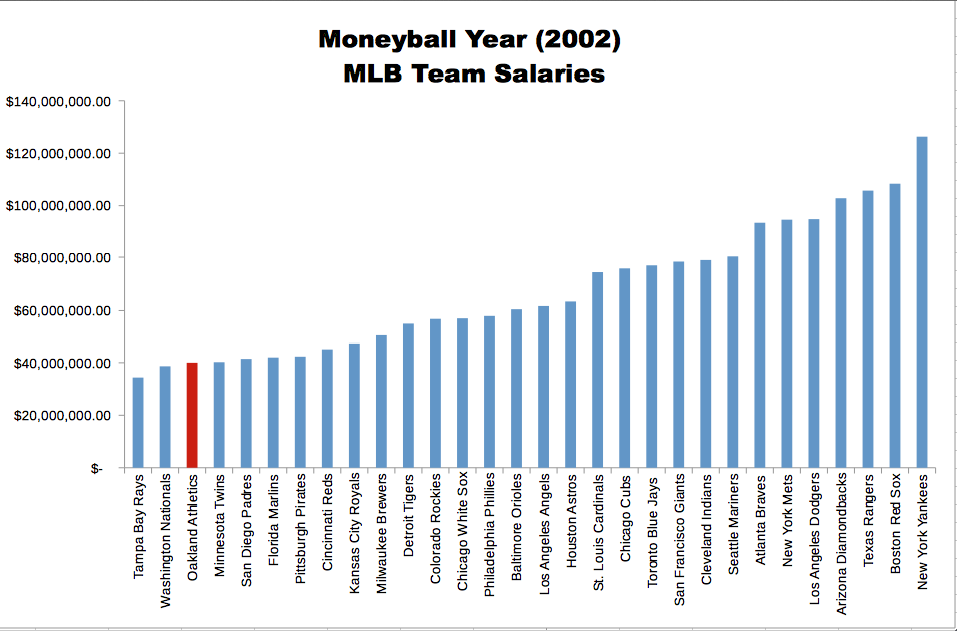

# MoneyBall Project

## Background

##### The 2002 Oakland A's

The Oakland Athletics' 2002 season was the team's 35th in Oakland, California. It was also the 102nd season in franchise history. The Athletics finished first in the American League West with a record of 103-59.
The Athletics' 2002 campaign ranks among the most famous in franchise history. Following the 2001 season, Oakland saw the departure of three key players (the lost boys). Billy Beane, the team's general manager, responded with a series of under-the-radar free agent signings. The new-look Athletics, despite a comparative lack of star power, surprised the baseball world by besting the 2001 team's regular season record. The team is most famous, however, for winning 20 consecutive games between August 13 and September 4, 2002. The Athletics' season was the subject of Michael Lewis' 2003 book Moneyball: The Art of Winning an Unfair Game (as Lewis was given the opportunity to follow the team around throughout that season)
This project is based off the book written by Michael Lewis (later turned into a movie).

##### Moneyball Book

The central premise of book Moneyball is that the collective wisdom of baseball insiders (including players, managers, coaches, scouts, and the front office) over the past century is subjective and often flawed. Statistics such as stolen bases, runs batted in, and batting average, typically used to gauge players, are relics of a 19th-century view of the game and the statistics available at that time. The book argues that the Oakland A's' front office took advantage of more analytical gauges of player performance to field a team that could better compete against richer competitors in Major League Baseball (MLB).
Rigorous statistical analysis had demonstrated that on-base percentage and slugging percentage are better indicators of offensive success, and the A's became convinced that these qualities were cheaper to obtain on the open market than more historically valued qualities such as speed and contact. These observations often flew in the face of conventional baseball wisdom and the beliefs of many baseball scouts and executives.
By re-evaluating the strategies that produce wins on the field, the 2002 Athletics, with approximately US 44 million dollars in salary, were competitive with larger market teams such as the New York Yankees, who spent over US$125 million in payroll that same season.





Because of the team's smaller revenues, Oakland is forced to find players undervalued by the market, and their system for finding value in undervalued players has proven itself thus far. This approach brought the A's to the playoffs in 2002 and 2003.
In this project we'll work with some data and with the goal of trying to find replacement players for the ones lost at the start of the off-season - During the 2001–02 offseason, the team lost three key free agents to larger market teams: 2000 AL MVP Jason Giambi to the New York Yankees, outfielder Johnny Damon to the Boston Red Sox, and closer Jason Isringhausen to the St. Louis Cardinals.
The main goal of this project is for you to feel comfortable working with R on real data to try and derive actionable insights!

## Let's get started!

##### Data

We'll be using data from Sean Lahaman's Website a very useful source for baseball statistics. The documentation for the csv files is located in the readme2013.txt file. You may need to reference this to understand what acronyms stand for.
Use R to open the Batting.csv file and assign it to a dataframe called batting using read.csv
```{r}
library(ggplot2)
```

```{r}
batting <- read.csv('Batting.csv')
head(batting)
str(batting)
```

```{r}
head(batting$AB)
head(batting$X2B)
```

###### Feature Engineering

Calculate meaningful data as introducted in the beginning.
We will calcultate the three numbers based off the statistical data.

1. Batting Average

$$AVG = \frac{H}{AB}$$

Using the R code to save calculated value as a new column.
```{r}
batting$BA <- batting$H / batting$AB
tail(batting$BA,5)
```
2. On-base percentage

$$ OBP = \frac{H+BB+HBP}{AB+BB+HBP+SF} $$

```{r}
batting$OBP <- (batting$H + batting$BB + batting$HBP) / (batting$AB + batting$BB + batting$HBP + batting$SF)
tail(batting$OBP,5)
```

3. Slugging percentage

$$ SLG = \frac{(1B)+(2 \times 2B)+(3 \times 3B)+(4 \times HR)}{AB} $$
```{r}
batting$X1B <- batting$H - batting$X2B - batting$X3B - batting$HR
batting$SLG <- (batting$X1B + 2*batting$X2B + 3*batting$X3B + 4*batting$HR) / (batting$AB)
tail(batting$SLG,5)
```


###### Merging Salary Data with Batting Data
We know we don't just want the best players, we want the most undervalued players, meaning we will also need to know current salary information! We have salary information in the csv file 'Salaries.csv'.
```{r}
sal <- read.csv('Salaries.csv')
head(sal)
```

Since the salary data starts at 1985 and batting data goes back to 1871, we need to remove unnecessary data from batting data
```{r}
batting <- subset(batting,yearID>=1985)
# Check the code above
min(batting$yearID)
```

Now it is time to merge the batting data with the salary data! Since we have players playing multiple years, we'll have repetitions of playerIDs for multiple years, meaning we want to merge on both players and years.
```{r}
combo <- merge(batting,sal,by=c('playerID','yearID'))
```

Use summary to check the data
```{r}
summary(combo)
```
###### Analyzing the Lost Players

As previously mentioned, the Oakland A's lost 3 key players during the off-season. We'll want to get their stats to see what we have to replace. The players lost were: first baseman 2000 AL MVP Jason Giambi (giambja01) to the New York Yankees, outfielder Johnny Damon (damonjo01) to the Boston Red Sox and infielder Rainer Gustavo "Ray" Olmedo ('saenzol01').

Use the subset() function to get a data frame called lost_players from the combo data frame consisting of those 3 players.
```{r}
lost.player <- subset(combo,combo$playerID %in% c('giambja01','damonjo01','saenzol01'))
```
Since all these players were lost in after 2001 in the offseason, let's only concern ourselves with the data from 2001.

Use subset again to only grab the rows where the yearID was 2001.
```{r}
lost.player <- subset(lost.player,lost.player$yearID == 2001)
```

Reduce the lost_players data frame to the following columns: playerID,H,X2B,X3B,HR,OBP,SLG,BA,AB
```{r}
lost.player <- lost.player[,c('playerID','H','X2B','X3B','HR','OBP','SLG','BA','AB')]
lost.player
```

##### Replacement Players

Now we have all the information we need! Here is your final task - Find Replacement Players for the key three players we lost! However, you have three constraints:

* The total combined salary of the three players can not exceed 15 million dollars.
* Their combined number of At Bats (AB) needs to be equal to or greater than the lost players.
* Their mean OBP had to equal to or greater than the mean OBP of the lost players

```{r}
combo.2011 <- subset(combo,combo$yearID ==2001)
sum.salary.constraint <- 15000000
sum.ab.constraint <- sum(lost.player$AB)
mean.obp.constraint <- mean(lost.player$OBP)
```

Data analysis with plot

First off, plot salary vs. OBP since these are our key constraints
```{r}
ggplot(combo.2011, aes(x=OBP,y=salary)) + geom_point(size=0.5)
```


We see that either OBP > 0.5 or is equal to 0 is considered outliers as they do not show a meaningful value due to their small data.
In other words, if a player gets to miss or hit a ball out of few appearances, the OBP is significantly leaned toward 0 or 1. Thus, we will remove those players. In addition, we see a lot of good players under 7000000 salary range so we will exclude those who are already valued high.

```{r}
combo.2011.revised <- subset(combo.2011,salary < 7000000 & OBP >0 & OBP < 0.5)
```

Now, let's examine the other constraint which is AB. Since the total of three ABs should not exceed that of lost players' AB, we like to choose the players whose AB is around the mean of AB by lost three players. 
```{r}
print(sum.ab.constraint/3)
```
```{r}
ggplot(combo.2011.revised, aes(x=AB)) + geom_histogram()

```
Them, we examine the average and exclude those who is far from the mean number in left-handed.
```{r}
combo.2011.revised2 <- subset(combo.2011.revised, AB >400 )
```

Now, let's see some possible condidates. To manipulate the remaining data, we will use dplyr library
```{r}
library(dplyr)
candidate <- arrange(combo.2011.revised2,desc(OBP))
```

Now remove some columns we are not interested
```{r}
candidate <- candidate[,c('playerID', 'AB','salary','OBP')]
```

Check if selected three players satisfy the constraints

Again, I rewrite the constraints from the above.

* The total combined salary of the three players can not exceed 15 million dollars.
* Their combined number of At Bats (AB) needs to be equal to or greater than the lost players.
* Their mean OBP had to equal to or greater than the mean OBP of the lost players

sum.salary.constraint <- 15000000
sum.ab.constraint <- sum(lost.players$AB)
mean.obp.constraint <- mean(lost.player$OBP)

Check if constraints are met
```{r}
sum(candidate[1:3,]$salary) < sum.salary.constraint
sum(candidate[1:3,]$AB) >= sum.ab.constraint
mean(candidate[1:3,]$OBP) >= mean.obp.constraint
```

Again
```{r}
sum(candidate[2:4,]$salary) < sum.salary.constraint
sum(candidate[2:4,]$AB) >= sum.ab.constraint
mean(candidate[2:4,]$OBP) >= mean.obp.constraint
```

All three are possible so now we randomly choose three players to see if that's also the case.
```{r}
test.candidate <- candidate[sample(nrow(candidate),3),]
sum(test.candidate$salary) < sum.salary.constraint
sum(test.candidate$AB) >= sum.ab.constraint
mean(test.candidate$OBP) >= mean.obp.constraint
test.candidate$playerID
```

Clearly, higher OBP are more likely the ones we are looking for.

Not to choose from the only top rows ordered by OBP, run the code above until we get the possible 3 players combination.
For simplicity, make the whole chuck as one function
```{r}
choose.three.players <- function() {
  possible <- TRUE
  while(possible) {
    test.candidate <- candidate[sample(nrow(candidate),3),]
    constrain.x1 <- sum(test.candidate$salary) < sum.salary.constraint
    constrain.x2 <- sum(test.candidate$AB) >= sum.ab.constraint
    constrain.x3 <- mean(test.candidate$OBP) >= mean.obp.constraint
    possible <- constrain.x1 & constrain.x2 &constrain.x3
  
    print(test.candidate)
  }
}
```

Run the function for the first sample.
```{r}
choose.three.players()
```

Second
```{r}
choose.three.players()
```

```{r}
choose.three.players()
```

Now we can generate many possible combinations not only from only top rows, but also from some bottom pool to meet our contraints!
