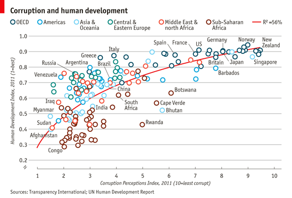

For this optional assignment we will be recreating this plot from The Economist:


Import the ggplot2 data.table libraries and use fread to load the csv file 'Economist_Assignment_Data.csv' into a dataframe called df (Hint: use drop=1 to skip the first column)
```{r}
library(ggplot2)
library(data.table)
df <- fread('Economist_Assignment_Data.csv',drop=1)
```

Check the head of df
```{r}
head(df)
```

Use ggplot() + geom_point() to create a scatter plot object called pl. You will need to specify x=CPI and y=HDI and color=Region as aesthetics
```{r}
pl <- ggplot(df,aes(x=CPI, y=HDI,color=Region))
print(pl + geom_point())
```
Change the points to be larger empty circles. (You'll have to go back and add arguments to geom_point() and reassign it to pl.) You'll need to figure out what shape= and size=
```{r}
print(pl + geom_point(size=3,shape=1))
```

Add geom_smooth(aes(group=1)) to add a trend line
```{r}
print(pl + geom_point(size=3,shape=1) + geom_smooth(aes(group=1)))
```

Draw the log-transformed graph, remove shades, and change the trend color
```{r}
pl2 <- pl + geom_point(size=3,shape=1) + geom_smooth(aes(group=1), method = 'lm',formula = y~log(x), se = FALSE, color = 'red')
print(pl2)
```

It's really starting to look similar! But we still need to add labels, we can use geom_text! Add geom_text(aes(label=Country)) to pl2 and see what happens. (Hint: It should be way too many labels)
```{r}
print(pl2 + geom_text(aes(label=Country)))
```

Labeling a subset is actually pretty tricky! So we're just going to give you the answer since it would require manually selecting the subset of countries we want to label!
```{r}
pointsToLabel <- c("Russia", "Venezuela", "Iraq", "Myanmar", "Sudan",
                   "Afghanistan", "Congo", "Greece", "Argentina", "Brazil",
                   "India", "Italy", "China", "South Africa", "Spane",
                   "Botswana", "Cape Verde", "Bhutan", "Rwanda", "France",
                   "United States", "Germany", "Britain", "Barbados", "Norway", "Japan",
                   "New Zealand", "Singapore")

pl3 <- pl2 + geom_text(aes(label = Country), color = "gray20", data = subset(df, Country %in% pointsToLabel),check_overlap = TRUE)

print(pl3)
```

Almost there! Still not perfect, but good enough for this assignment. Later on we'll see why interactive plots are better for labeling. Now let's just add some labels and a theme, set the x and y scales and we're done!
Add theme_bw() to your plot and save this to pl4
```{r}
pl4 <- pl3 + theme_bw()
print(pl4)
```

Add scale_x_continuous() and set the following arguments:
name = Same x axis as the Economist Plot
limits = Pass a vector of appropriate x limits
breaks = 1:10
```{r}
pl5 <- pl4 + scale_x_continuous(name='Corruption Perceptions Index, 2011 (10=least corrupt)',limits = c(0.5,10.5),breaks = 1:10)
print(pl5)
```

Now use scale_y_continuous to do similar operations to the y axis!
```{r}
pl6 <- pl5 + scale_y_continuous(name = 'Human Development Index, 2011 (1=Best)',limits = c(0.2,1.0), breaks = seq(0.2,1,by=0.2))
print(pl6)
```

Finally use ggtitle() to add a string as a title.
```{r}
pl7 <- pl6 + ggtitle("Corruption and Human development")
print(pl7)
```


```{r}
library(ggthemes)
pl8 <- pl7 + theme_economist_white()
print(pl8)
```